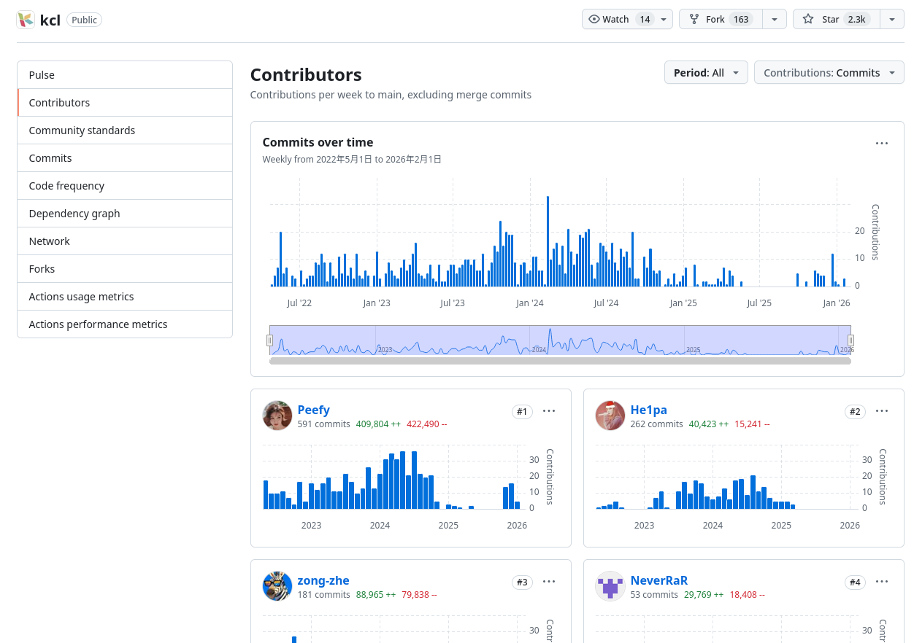
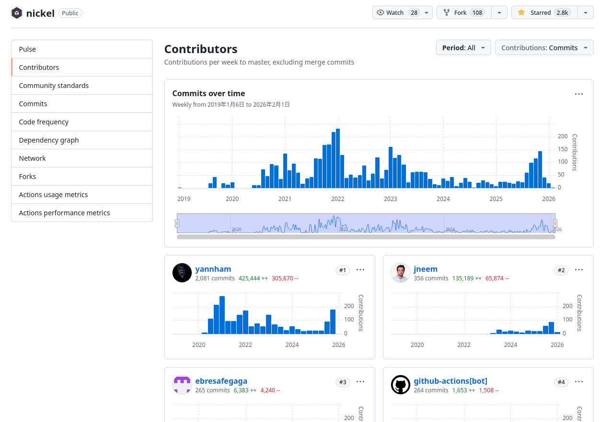

# Nickel 还是 KCL

## 两者区别

直接引用 Nickel 文档里写的[两者的区别](https://github.com/nickel-lang/nickel/blob/master/RATIONALE.md#kcl-vs-nickel)：

> **KCL: python-like syntax with object-oriented schemas**
> 
> The KCL configuration language supports validation against object-oriented
> schemas that can be combined through inheritance and mixins. It has functions
> and modules, supports configuration merging,
> and ships with a large collection of validation modules.
> 
> **KCL vs Nickel**
> 
> The KCL typesystem feels more nominal and object-oriented than Nickel's:
> 
> - in KCL you specify the name of the schema when you're writing out the object
>   that's supposed to conform to it; in Nickel, you can write out a record first
>   and then apply the contract at some later point
> - in KCL, schema inheritance and mixins are written explicitly; in Nickel, complex
>   contracts are built compositionally, by merging smaller ones.
> 
> But the bigger difference is that KCL's schema validation is strict while Nickel's
> is lazy. This may make Nickel better suited to partial evaluation of large
> configurations.

KCL 和 Nickel 的能力边界类似，都可以定义约束，并将约束应用到数据上。

总结两者的主要区别在以下几点：

- KCL 的组织形式更加“整体”，更强调某个配置的完整性。
  Nickel 则更“分散”，通过精心设计的合并、覆写功能将各个模块组织起来。
- KCL 的语法更加类似 Python/Go, 功能的设计比较分散，更加扁平。
  Nickel 的语法更像 Nix/Haskell, 实际应用时更加依赖具体的组织和约定。
- KCL 是严格求值的，Nickel 是惰性求值的。

## 针对 openRuyi 需求的具体分析

在现阶段，有两种可能的前端（软件包定义）和后端（定义转换和构建）可能通过两种形式来交互：

1. 后端通过二进制调用前端来将配置求值为通用数据类型（JSON, YAML ...），
   之后在后端进行进一步处理和构建。
2. 前端通过插件来主动调用后端。
   这个方案更加类似 Nix (比如 Nix 的 mkDerivation 函数), 未来的抽象空间也更大。

分别从两个方案的角度来看：

**方案 1** 对前端的需求不像 Nix 那样需要有极致的动态能力，也不需要整个软件包仓库被组织为一个
整体。

但是考虑到未来可能增加的二分定位错误位置、可选的其他后端等功能，我们仍然需要前端语言有
一定的动态能力来承载这些功能。

**方案 2** 需要前端语言有插件的能力。KCL 有文档描述它的插件系统，Nickel 目前没有基于动态链接
的插件系统，但是可以通过另一个程序解析 Nickel 的输出内容来曲线救国。

两个方案都能满足 openRuyi 的现有需求，但是对前端语言的选型会有影响。

## 技术之外的因素

KCL 由蚂蚁集团开发，Nickel 由国外的 Tweag by Modus Create 公司开发。

KCL 和 Nickel 现阶段的维护积极性不太一样：

可能是因为 KCL 的功能已经基本稳定，但是从现存的仓库状态来看，
Nickel 有 RFCS 和各个功能的需求分析，长期稳定性似乎会更高。

